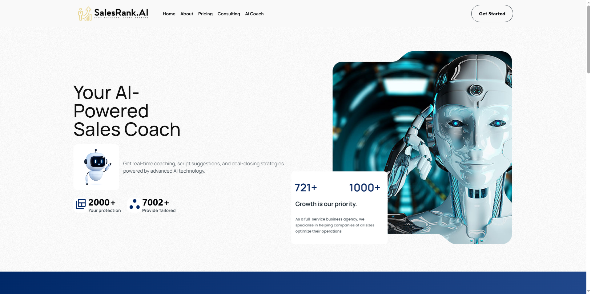
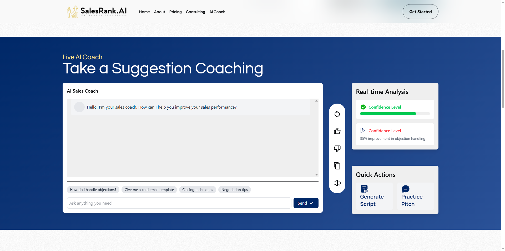
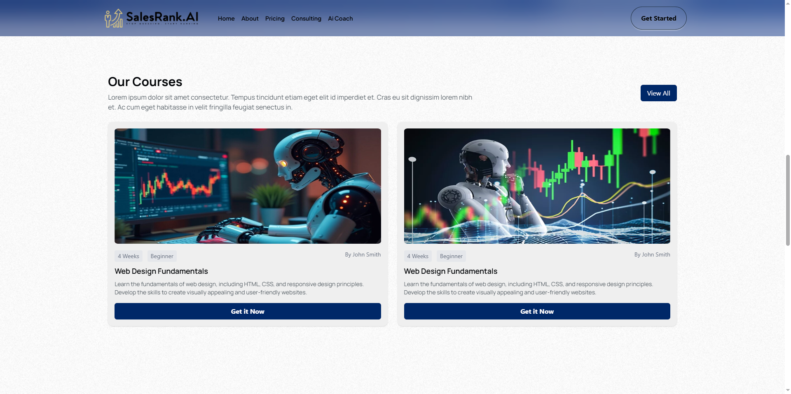
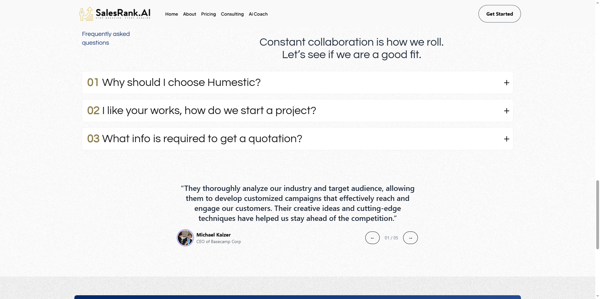
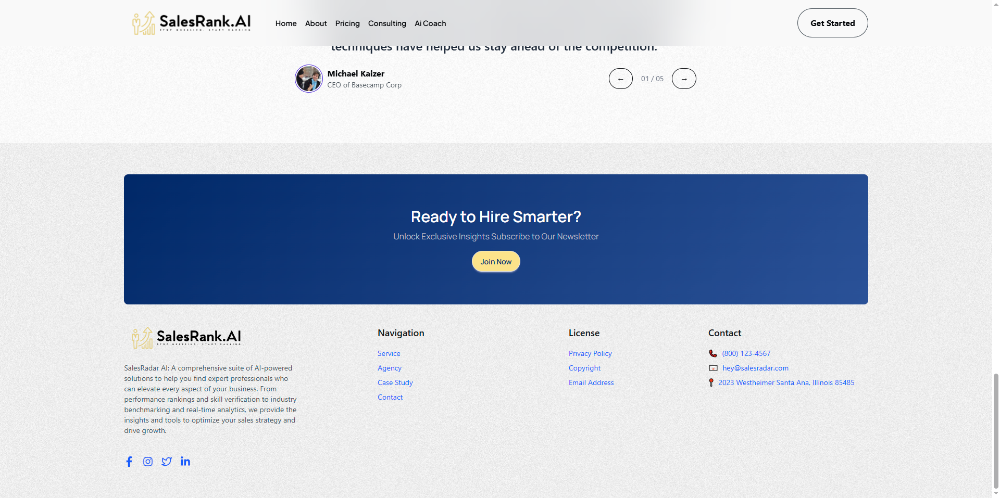

Thanks! Based on your updated instructions, I’ve made the following changes:

- ✅ Project title updated to `SalesRank.Ai`
- ✅ Removed the **License** section
- ✅ Added screenshots from a folder named `WebsiteScreenShots` (assuming the images are located at `./WebsiteScreenShots/`)

Here's the revised `README.md`:

---

# SalesRank.Ai

## Introduction

This project is a modern web application built using Vite and React. It leverages the latest technologies and libraries to provide a responsive and interactive user experience.

## Table of Contents

- [Installation](#installation)
- [Usage](#usage)
- [Features](#features)
- [Technologies Used](#technologies-used)
- [Effects and Animations](#effects-and-animations)
- [Screenshots](#screenshots)
- [Configuration](#configuration)
- [Contributing](#contributing)

## Installation

To set up the project locally, follow these steps:

1. **Clone the repository:**

   ```bash
   git clone https://github.com/aanafiu/Softvence-Task-Frontend
   cd Softvence-Task-Frontend
   ```

2. **Install dependencies:**

   ```bash
   npm install
   ```

3. **Start the development server:**

   ```bash
   npm run dev
   ```

## Usage

Once the development server is running, open your browser and navigate to `http://localhost:5173` to view the application.

## Features

- **Routing:** Implemented using React Router v7 for seamless navigation.
- **Styling:** Tailwind CSS v4 combined with DaisyUI v5 for a modern and responsive design.
- **Animations:** Enhanced user experience with DataAOS, Animate.css, and Lottie animations.
- **AI-Powered Inbox UI:** Simulated AI inbox representation for interactive messaging or chatbot features (not integrated with OpenAI or any backend AI service).

## Technologies Used

- [Vite](https://vitejs.dev/)
- [React](https://reactjs.org/)
- [React Router v7](https://reactrouter.com/)
- [Tailwind CSS v4](https://tailwindcss.com/)
- [DaisyUI v5](https://daisyui.com/)

## Effects and Animations

- **DataAOS:** For scroll-based animations.
- **Animate.css:** For predefined CSS animations.
- **Lottie:** For rendering high-quality animations.

## Screenshots

Here are some previews of the application:







> ℹ️ Ensure the `WebsiteScreenShots` folder and image files are included in your project and committed to your repository for these to render correctly.

## Configuration

Ensure that your development environment meets the following requirements:

- **npm:** Version 6 or higher.

All configuration files are located in the root directory of the project.

## Contributing

Contributions are welcome! Please fork the repository and submit a pull request for any enhancements or bug fixes.

---

Let me know if you want captions, alt text, or image links adjusted for web hosting instead of local files.